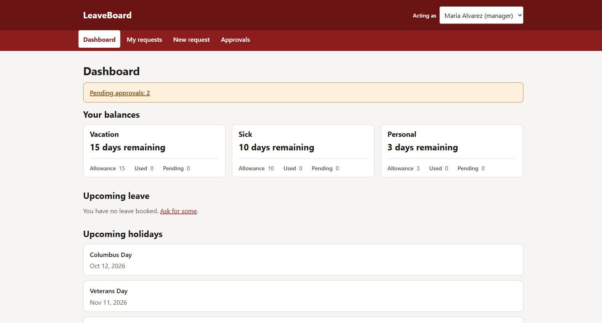
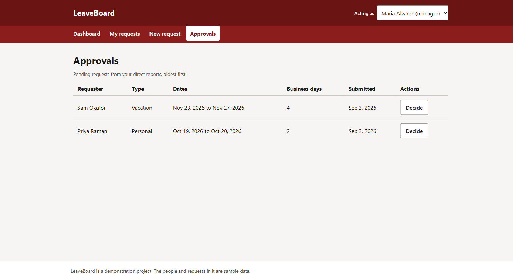
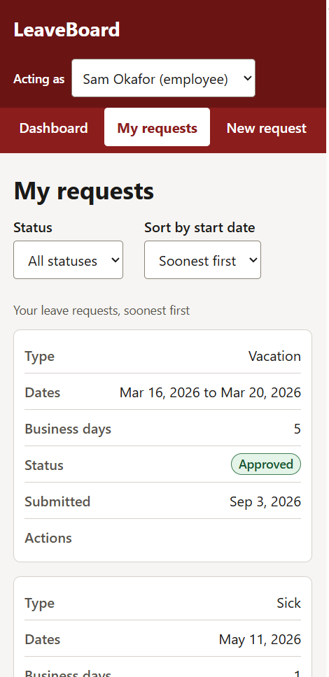

# LeaveBoard

A small web application for submitting, tracking, and approving employee leave requests.

Employees see their balances, submit a request, and watch it move through approval. Managers
get a queue of their direct reports' pending requests and approve or deny with a note. The
form counts business days as you pick dates, excluding weekends and US public holidays
fetched from a live API.

Built to be accessible first: WCAG 2.1 AA is the definition of done for every page. Every page
and shared component has a `jest-axe` test that runs in CI, the responsive behavior is
measured at four widths rather than eyeballed, and what has and has not been verified by hand
is recorded in [the accessibility guide](./docs/ACCESSIBILITY.md) — including the manual
screen reader pass, which is the one item still outstanding.

> Status: feature complete and running locally against a real database. Not yet deployed —
> the live URL lands with v1.0.0, and [the deployment runbook](./docs/DEPLOYMENT.md) is what
> it takes to get there.

## Screenshots

The dashboard, as a manager: balance cards, the pending-approvals callout, and the next
public holidays pulled from the holiday API.



A manager's approval queue, oldest request first.



The same table on a phone. Below 640px each row becomes a card with its own labels rather
than a grid you have to scroll sideways, and status is carried by the word as well as the
color.



## Stack

| Layer     | Choice                                                       |
| --------- | ------------------------------------------------------------ |
| Front end | React 18, Vite, React Router, hand-written CSS               |
| Back end  | Node 20, Express, Zod validation, `pg`                       |
| Database  | PostgreSQL 16                                                |
| Testing   | Vitest, Supertest, React Testing Library, `jest-axe`         |
| CI        | GitHub Actions: lint, formatting, contract validation, tests |

No UI kit and no CSS framework. The CSS is hand-written because writing it is part of the
point.

## Running it locally

Requires Node 20+ and Docker.

```
npm install
cp server/.env.example server/.env && cp client/.env.example client/.env
docker compose up -d db
npm run db:migrate && npm run db:seed
npm run dev:server        # http://localhost:3001
npm run dev:client        # http://localhost:5173
```

The seed creates one manager (Maria) and two employees (Sam and Priya) who report to her,
along with a few requests in each state. There is no login: a header control switches which
seeded user you are acting as. That is a deliberate scope cut, recorded in
[ADR 0001](./docs/adr/0001-no-auth.md).

The front end also runs with no API at all — set `VITE_USE_MOCKS=true` in `client/.env` and
every endpoint is served from the MSW handlers in `client/src/mocks/`.

## Tests

```
npm test              # both workspaces
npm run lint
npm run format:check
```

## Documentation

- [Design document](./docs/DESIGN.md) — the specification this was built against
- [API reference](./docs/API.md) — every endpoint with examples
- [`openapi.yaml`](./docs/openapi.yaml) — the machine-readable contract
- [Accessibility](./docs/ACCESSIBILITY.md) — the checklist and how it was verified
- [Contributing](./docs/CONTRIBUTING.md) — branching, review, and CI workflow
- [Deployment](./docs/DEPLOYMENT.md) — the runbook for standing this up on Neon, Render and Vercel
- [Decision records](./docs/adr/) — why the notable choices were made
